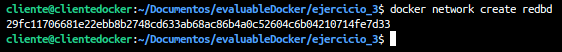
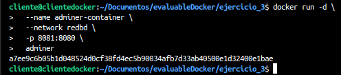
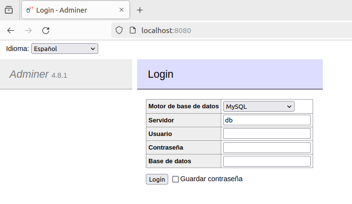
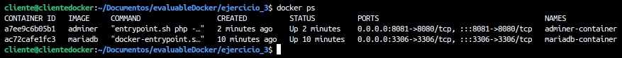
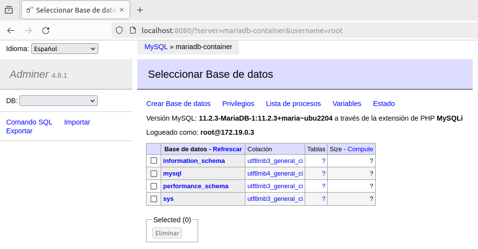
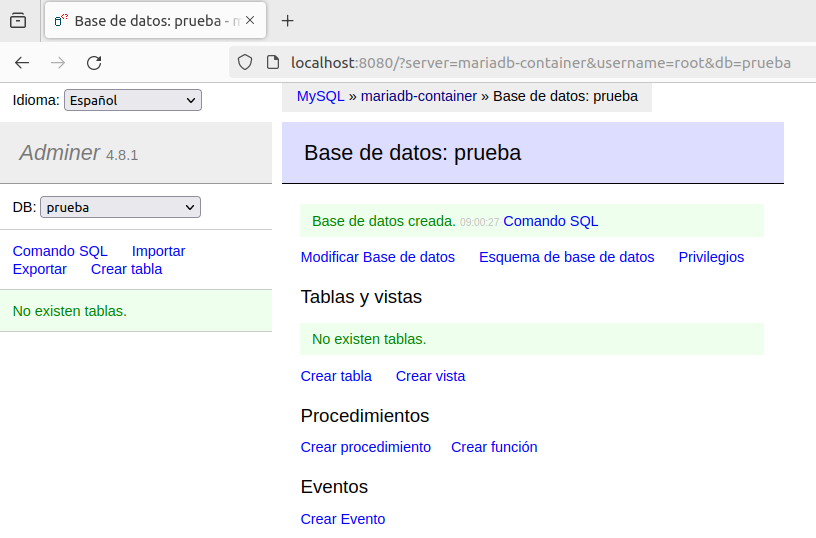
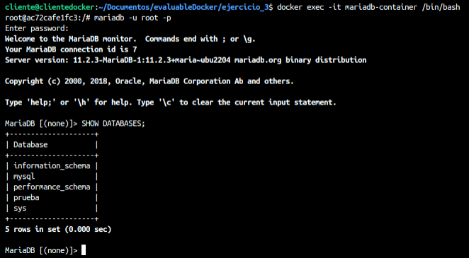
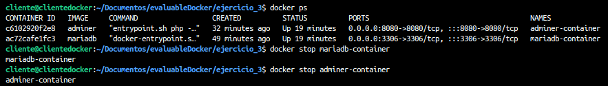
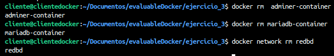
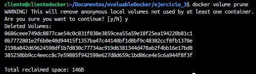

# Ejercicio 3 - contenedores en red: Adminer y MariaDB

> Alba Barrio González 

[TOC] 

### Apartado 1

Crea una red bridge redbd

```bash
docker network create redbd
```




### Apartado 2

Crea un contenedor con una imagen de mariaDB que estará en la red redbd . Este contenedor se ejecutará en segundo plano, y será accesible a través del puerto 3306. (Es necesario definir la contraseña del usuario root y un volumen de datos persistente)

```bash
docker run -d \
>   --name mariadb-container \
>   --network redbd \
>   -p 3306:3306 \
>   -e MYSQL_ROOT_PASSWORD=1234 \
>   -v /Documentos/evaluableDocker/ejercicio_3:/var/lib/mysql \
>   mariadb
```


### Apartado 3

Crear un contenedor con Adminer que se pueda conectar al contenedor de la BD

```bash
docker run -d \
  --name adminer-container \
  --network redbd \
  -p 8080:8080 \
  adminer
```




### Apartado 4

Comprobar que el contenedor Adminer puede conectar con el contenedor mysql abriendo un navegador web y accediendo a la URL: http://localhost:8080



### Documentación

Captura de pantalla y documento donde se vean los contenedores creados y en ejecución

```bash
docker ps
```




Captura de pantalla y documento donde se vea el acceso a la BD a través de la interfaz web de Adminer




Captura de pantalla y documento donde se vea la creación de una BD con la interfaz web Adminer




Captura de pantalla y documento donde se entre a la consola del servidor web en modo texto y se compruebe que se ha creado la BD

```bash
docker exec -it mariadb-container /bin/bash
mariadb -u root -p
SHOW DATABASES;
```




Borrar los contenedores la red y los volúmenes utilizados

```bash
docker ps
docker rm adminer-container
docker rm mariadb-container
docker network rm redbd
docker volume prune
```





