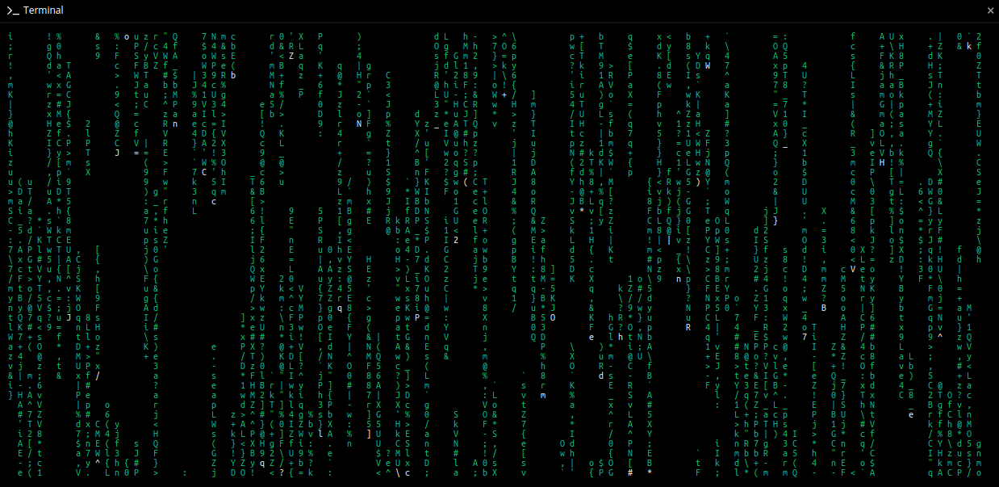

# Ejercicio 4 - Docker Compose

> Alba Barrio González 

[TOC] 

Desplegar la aplicación **cmatrix** utilizando docker-compose.

1. Descargamos la imagen de dockerHub

   ```bash
   docker pull defnotgustavom/cmatrix
   ```

   
   
   

2. Creamos el archivo docker-compose.yml

   ```bash
   version: '3.1'
   services:
     cmatrix:
       container_name: cmatrix
       image: defnotgustavom/cmatrix
       restart: always
       tty = true
   ```

   

3. Iniciamos el contenedor definido en el archivo `docker-compose.yml` y comprobamos

   ```bash
   docker-compose up -d
   docker-compose ps
   ```

   


4. Ejecutamos la aplicación

   ```bash
   docker run --rm -it defnotgustavom/cmatrix cmatrix -C green
   ```

   



La aplicación cmatrix es una herramienta que simula la visualización de código como en la película "The Matrix". Cuando se ejecuta, muestra una  secuencia de caracteres aleatorios que parecen caer en cascada por la  pantalla, creando el efecto visual conocido como "Green Rain" o "Matrix  Rain".